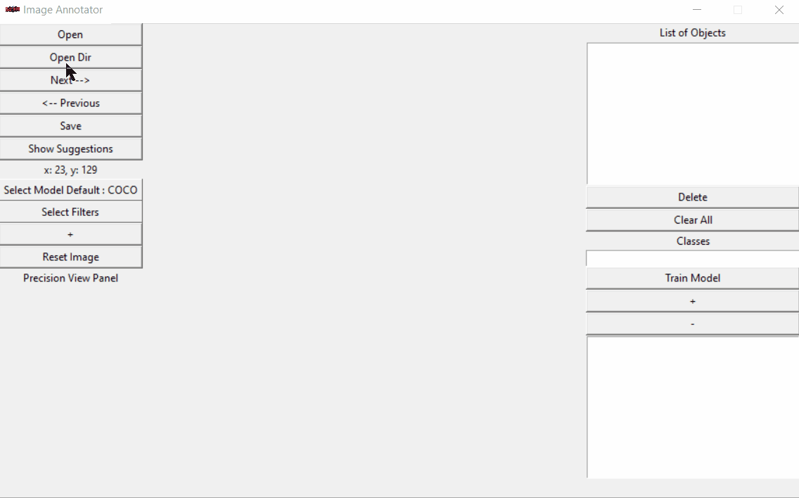
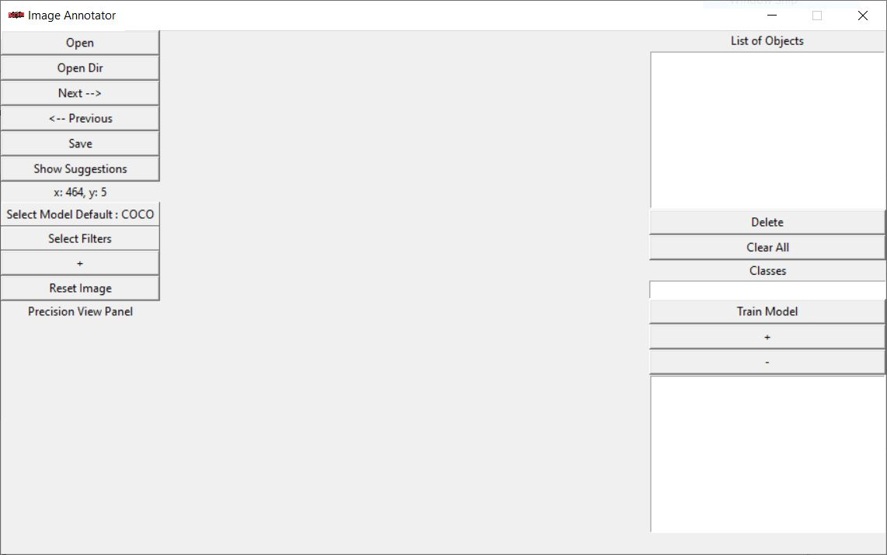

# Semi Automatic Image Annotataor

Semi Automatic Image Annotation Toolbox with RetinaNet, SSD and YOLO as the suggesting algorithm. We can select from the three algorithms as the suggesting algorithm. Filters can be applied to images to create distorting images which will help in the training of the model. Also the training process is incoperated in the application. You can train a Retinanet model for custom objects in one click.



## Installation

1) Clone this repository.

2) Create a virtual environment with anaconda packages installed.
```
conda create --name virtual_env anaconda
```

3) In the repository, execute `pip install -r requirements.txt`.

4) Download the pretrained weights and save it in /snapshots.

   a) [Retinanet weights](https://github.com/fizyr/keras-retinanet/releases/download/0.3.1/resnet50_coco_best_v2.1.0.h5)
   
   b) [SSD weights](https://drive.google.com/uc?authuser=0&id=1fyDDUcIOSjeiP08vl1WCndcFdtboFXua&export=download)
   
   c) [YOLO weights](https://drive.google.com/uc?id=1dckkRQjovO_2SRH1x8q7kKKGb5OACOQW&export=download)


### Instructions

After all the dependencies are installed go into the repository and run the main.py scripts by using the flowing command in the anaconda prompt or open the main.py in spyder ide and run the script(Recommended)
```
python main.py
```
Make sure that the weights are installed and are saved in the /snapshots folder. The names of the weights used in the application are given in the /snapshots/instruction.md file. Change the names of the weight to match the names given there.
If everything goes right an application window will open which will look something like this:



Let’s walk you through the GUI:
1) Open – Open a single image.
2) Open Dir – Open a directory containing images.
3) Next--> - Next image from the directory.
4) <-- Previous – Previous image from the directory
5) Save – Saves the images location in annotation file. However, the image location is also saved when we click the Next or Previous buttons also.
6) Show Suggestions - Shows the objects detected on the images.
7) Select Model – Can select from 3 Models i.e Retinanet or COCO, SSD and YOLO. Note that the COCO model is trained on 80 classes and is fairly fast in detecting objects, the YOLO class is also trained on similar classes but is slower than the tree models. SSD model on the other hand is only trained on 21 classes and is the fastest among these three
8) Select Filters – Can select up to 5 filters. This will to create different variants of the same images which will help in the training process.
9) \+ - this will open a window to add parameters to the selected filters.
10) Reset image – Reset the image to the original image.
11) List of objects – List the detected objects with their coordinates.
12) Delete – Delete the selected class from the list of objects.
13) Clear All – Clears all the detected boxes from the images and classes from the List of Objects.
14) Classes – Input label where you can type new classes and click ‘+’ sign to add it to the list..
15) \+ -> Adds the class.
16) \-  -> Deletes the class.

The labels and the file path are save in the annotations folder which then can be used to train a model on custom objects.
The training process only supports the retinanet algorithm for now but soon will be updated to support the SSD and YOLO algorithms as well.

Once you will click the train model button a window screen will pop up which will have some inputs to be filled.
1. Backbone : The model can be trained on three of the backbones namely resnet50, resnet101 and resnet150.
2. Epochs : Number of epochs.
3. Steps – Steps to train.
4. Annotation file
5. Classes file
6. Weights of the pretrained model.In out case the retinanet weights.


### Usage
```
python main.py
```

### Tested On:
1) Windows 10

---
**NOTE**

Soon to test on Linux environment.

I am working on some new updates and is constantly commiting changes to the repository. So it is likely that some of the features may not work at this point.
Updates I am working on :
1. Adding a custom pretrained resnet model.

---

### Acknowledgments

1) [Semi Automatic Image Annotatror on Retinanet by Viraj Mavani](https://github.com/virajmavani/semi-auto-image-annotation-tool)

2) [Keras implementation of RetinaNet object detection](https://github.com/fizyr/keras-retinanet)
